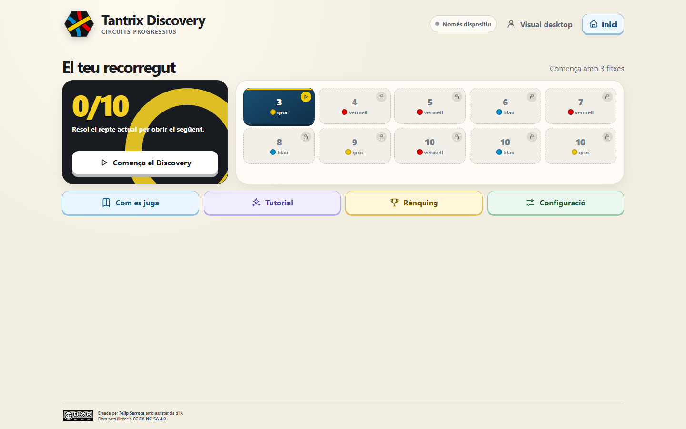
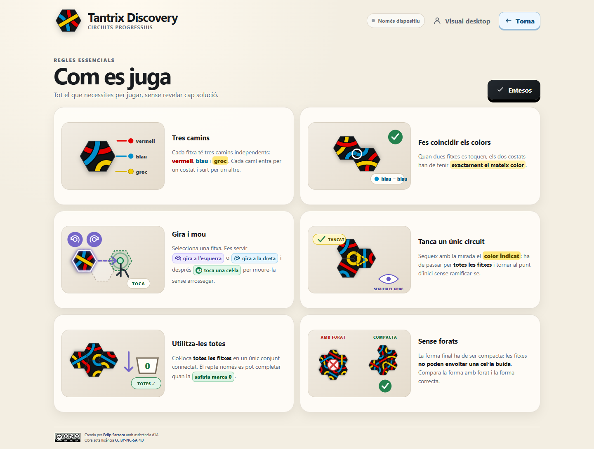
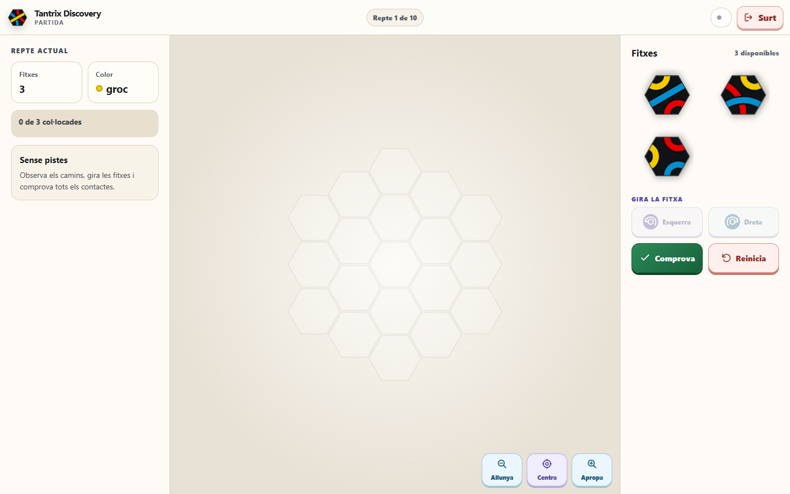
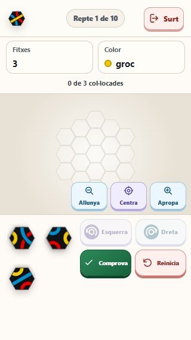
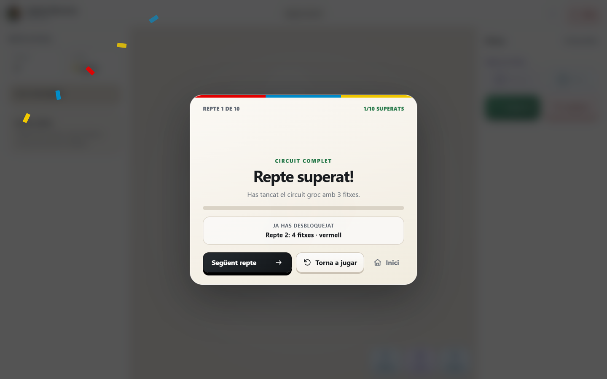
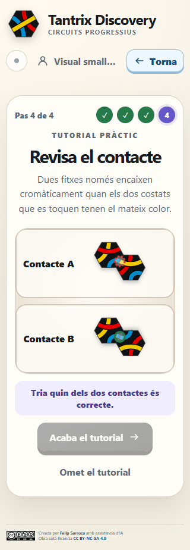
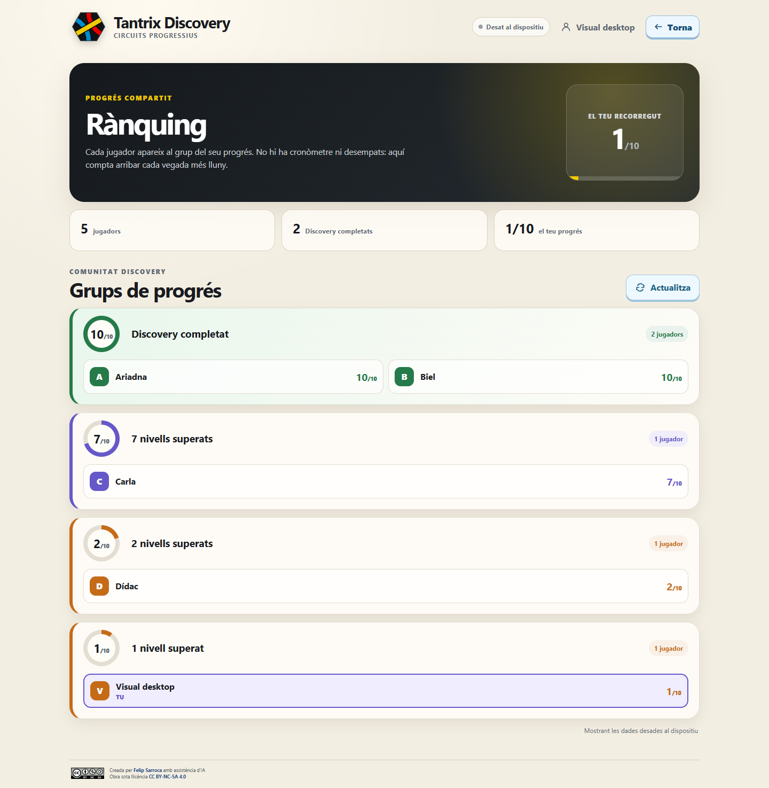
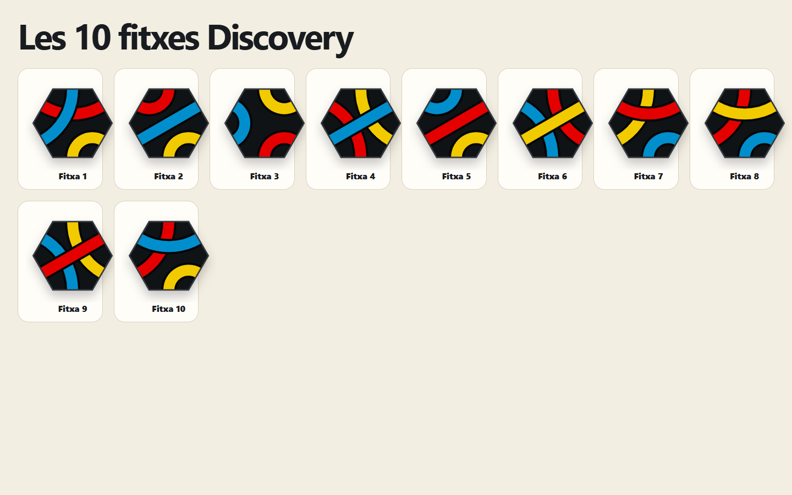

<p align="center">
  
</p>

<h1 align="center">Tantrix Discovery</h1>

<p align="center">
  Joc web progressiu en català per resoldre deu circuits Tantrix, de 3 a 10 fitxes, sense pistes i amb una experiència fidel al joc físic.
</p>

<p align="center">
  <a href="https://ja.cat/tantrix"><strong>Juga-hi ara</strong></a>
  ·
  <a href="https://felipsarroca.github.io/jocs/Tantrix/">GitHub Pages</a>
  ·
  <a href="especificacio_app_tantrix_discovery.md">Especificació completa</a>
  ·
  <a href="qa/QA_REPORT.md">Informe de qualitat</a>
</p>

<p align="center">
  Versió 1.3.0 · PWA instal·lable · Local-first · Responsive · CC BY-NC-SA 4.0
</p>



## Què és

Tantrix Discovery és una aplicació web educativa i no avaluativa que adapta la seqüència de reptes Discovery. El jugador ha de construir un únic circuit del color indicat fent servir totes les fitxes disponibles. No hi ha pistes, contactes atenuats ni correccions parcials: s’observen, es giren i es mouen les peces com en el joc físic, i la composició només es valida quan el jugador prem `Comprova`.

L’app està pensada perquè funcioni igualment bé en mòbil, tauleta i ordinador. El progrés es desa primer al dispositiu i, quan hi ha connexió, només les primeres superacions pendents se sincronitzen amb un Google Sheets privat mitjançant Google Apps Script.

## Característiques principals

- Deu reptes progressius amb 3, 4, 5, 6, 7, 8, 9 i 10 fitxes.
- Desbloqueig estricte: cal resoldre un repte per obrir el següent.
- Selecció lliure de qualsevol nivell després de completar el 10/10.
- Fitxes SVG generades programàticament amb els 30 camins i les corbes del joc.
- Taulell hexagonal, rotacions exactes de 60° i comprovació de tots els contactes.
- Cap pista visual o textual sobre la solució.
- Tutorial pràctic de quatre passos que exigeix seleccionar, girar, moure i identificar un contacte correcte.
- Guia visual creada amb el mateix renderer i la mateixa geometria axial que la partida.
- Interacció per toc, arrossegament, ratolí i teclat.
- Desat automàtic local amb IndexedDB i cua de sincronització idempotent.
- Rànquing propi agrupat per nombre de nivells superats, sense mostrar la graella de Sheets.
- PWA instal·lable i capaç d’arrencar sense connexió.
- Disseny accessible, amb reflow al 200%, focus visible i patrons cromàtics opcionals.
- Interfície íntegrament en català.

## Com es juga

Cada repte mostra dues dades essencials: el nombre de fitxes i el color del circuit. Per superar-lo cal complir simultàniament aquestes regles:

1. Col·locar totes les fitxes al taulell.
2. Fer coincidir exactament els colors de tots els costats que es toquen.
3. Mantenir totes les peces connectades en un únic conjunt compacte.
4. No envoltar cap cel·la buida.
5. Tancar un únic circuit del color indicat que passi per totes les fitxes.



### Controls

| Acció | Mòbil i tauleta | Ratolí | Teclat |
|---|---|---|---|
| Seleccionar | Toca una fitxa | Clic sobre una fitxa | `Tab` i `Enter` o `Espai` |
| Moure | Toca la fitxa i després una cel·la, o arrossega-la | Clic + cel·la o arrossegament | Fletxes amb una fitxa seleccionada |
| Girar a l’esquerra | Botó `Esquerra` | Botó `Esquerra` | `Q` |
| Girar a la dreta | Botó `Dreta` o segon toc sobre la peça seleccionada | Botó `Dreta` o segon clic | `E` |
| Apropar o allunyar | Botons del taulell | Botons del taulell | `+` / `−` |
| Centrar | Botó `Centra` | Botó `Centra` | `0` |
| Comprovar | Botó `Comprova` | Botó `Comprova` | — |
| Reiniciar | Botó `Reinicia` | Botó `Reinicia` | — |
| Deseleccionar | Toca fora de la fitxa | Clic fora de la fitxa | `Esc` |

## Experiència de joc

<table>
  <tr>
    <td width="68%">
      
    </td>
    <td width="32%">
      
    </td>
  </tr>
  <tr>
    <td align="center"><strong>Ordinador</strong>: repte, taulell i safata en tres zones clares.</td>
    <td align="center"><strong>Mòbil</strong>: controls compactes i peces adaptades al tacte.</td>
  </tr>
</table>

Quan la solució és correcta, l’app centra el circuit i mostra una celebració única amb el progrés aconseguit, el repte desbloquejat i un botó directe per continuar.



## Tutorial pràctic

El tutorial no és una successió de pantalles passives. El botó per avançar es manté desactivat fins que el jugador completa l’acció del pas:

1. Seleccionar una fitxa real de la safata.
2. Girar-la exactament 60 graus.
3. Moure-la sense arrossegar, tocant la fitxa i la cel·la de destinació.
4. Distingir entre un contacte cromàtic incorrecte i un de correcte.

<p align="center">
  
</p>

## Progressió i rànquing

Abans de completar el recorregut només està disponible el repte actual. Els reptes superats, l’actual i els bloquejats es diferencien amb color, forma i icona. Quan el jugador arriba al 10/10 pot tornar a jugar qualsevol repte.

El rànquing agrupa les persones per progrés —per exemple, `Discovery completat`, `7 nivells superats` o `2 nivells superats`— i ordena alfabèticament els noms dins de cada grup. No conté taules administratives, iframes ni cap visualització del full privat.



## Les deu fitxes

Totes les fitxes es construeixen en SVG a partir de dades immutables. Cada peça conté tres camins independents —vermell, blau i groc— formats amb arcs tancats, arcs oberts o rectes. El mateix renderer s’utilitza al joc, al tutorial, a la guia i a les proves visuals.



## Arquitectura

L’aplicació utilitza HTML, CSS i JavaScript natius amb Vite com a eina de desenvolupament i empaquetament. No depèn de cap framework d’interfície.

```text
Tantrix/
├── src/
│   ├── api/          # Client d’Apps Script i cua de sincronització
│   ├── data/         # Definició immutable de fitxes i reptes
│   ├── domain/       # Geometria hexagonal, validació i rànquing
│   ├── game/         # Estat i operacions de la partida
│   ├── render/       # Renderer SVG únic de les fitxes
│   ├── storage/      # Persistència local amb IndexedDB
│   ├── main.js       # Navegació, pantalles i interaccions
│   └── styles/       # Sistema visual responsive
├── tests/
│   ├── e2e/          # Fluxos Playwright i captures visuals
│   ├── fixtures/     # Solucions independents per als deu reptes
│   └── unit/         # Proves de domini, dades i persistència
├── qa/               # Informe final de qualitat
├── docs/images/      # Captures estables utilitzades en aquest README
├── public/           # Manifest, icones, llicència i service worker
├── scripts/          # Preparació i verificació de producció
├── index.source.html # Entrada HTML de Vite
└── index.html        # Versió generada per a GitHub Pages
```

### Flux local-first

```text
Moviment o gir
    └── desat immediat al dispositiu

Primera superació d’un repte
    ├── desat immediat a IndexedDB
    ├── celebració sense esperar la xarxa
    └── cua de sincronització
            └── Apps Script → Google Sheets privat
```

Els moviments, girs, zoom, intents fallits i repeticions no s’envien al servidor. Si la xarxa falla, el joc continua i la fita pendent es reintenta més endavant.

## Posada en marxa local

### Requisits

- Node.js 20.19 o posterior.
- npm, inclòs amb Node.js.
- Chromium de Playwright per executar les proves E2E.

### Instal·lació

```powershell
git clone https://github.com/felipsarroca/jocs.git
Set-Location jocs\Tantrix
npm ci
npm run dev
```

Vite mostrarà l’adreça local. Per defecte el servidor només escolta a `127.0.0.1`.

### Build de producció

```powershell
npm run build
npm run preview
```

La sortida es genera a `dist/`. La base dels actius és relativa perquè el paquet funcioni tant a l’arrel com dins la subcarpeta `/jocs/Tantrix/`.

## Scripts disponibles

| Ordre | Finalitat |
|---|---|
| `npm run dev` | Inicia el servidor de desenvolupament. |
| `npm run build` | Genera el paquet optimitzat a `dist/`. |
| `npm run preview` | Serveix localment el build de producció. |
| `npm run build:pages` | Genera el build i prepara a l’arrel els fitxers publicables a GitHub Pages. |
| `npm run test` | Executa les 54 proves unitàries amb Vitest. |
| `npm run test:watch` | Manté les proves unitàries en mode interactiu. |
| `npm run test:e2e` | Executa els 35 fluxos Playwright en cinc formats de pantalla. |
| `npm run test:pwa` | Verifica la instal·lació del service worker i l’arrencada sense xarxa. |
| `npm run test:pages` | Comprova el funcionament sota la subcarpeta pública `/Tantrix/`. |
| `npm run test:remote` | Verifica el backend de producció en mode de només lectura. |
| `npm run test:all` | Executa la bateria local principal. |

## Qualitat i proves

La versió 1.3.0 s’ha comprovat en aquests cinc viewports:

| Perfil | Mida CSS |
|---|---:|
| Mòbil petit | 320 × 568 |
| Mòbil | 390 × 844 |
| Tauleta | 820 × 1180 |
| Ordinador | 1440 × 900 |
| Mòbil horitzontal | 932 × 430 |

Resultat de la bateria final:

- 54/54 proves unitàries superades.
- 35/35 fluxos E2E superats.
- 75 captures visuals revisades.
- Deu solucions completes verificades de manera independent.
- PWA i arrencada sense connexió comprovades.
- Publicació dins `/Tantrix/` comprovada.
- Connexió de només lectura amb Apps Script comprovada des d’un navegador real.
- Cap error de consola ni desbordament horitzontal conegut.

Els detalls dels 27 cicles de revisió són a l’[informe final de qualitat](qa/QA_REPORT.md).

## Google Sheets i Apps Script

Google Sheets és exclusivament la persistència remota privada. L’app no mostra ni documenta l’adreça del full o de l’endpoint i no permet explorar-ne la graella.

El full de producció conté quatre pestanyes:

- `CONFIG`
- `PLAYERS`
- `COMPLETIONS`
- `RANKING`

El backend valida novament cada fita abans de desar-la. La cua utilitza identificadors idempotents per evitar duplicats quan es repeteix una petició.

### Manteniment del backend existent

El codi del backend viu a `apps-script/`, però aquesta carpeta, `.clasp.json`, els identificadors i les credencials estan exclosos de Git. En un entorn autoritzat:

```powershell
clasp push --force
clasp deploy --deploymentId $env:TANTRIX_DEPLOYMENT_ID --description "Descripció de la versió"
```

No s’han d’escriure mai l’ID del full, l’Script ID, l’URL privada o altres credencials al README, al codi versionat o a l’historial de Git.

### Instal·lació independent

Per crear un backend nou i desvinculat del de producció:

1. Crea un Google Sheets privat.
2. Crea un projecte de Google Apps Script i copia-hi el contingut de `apps-script/`.
3. Afegeix `SPREADSHEET_ID` a les propietats de l’script.
4. Executa manualment `setupSpreadsheet()` i `runSelfTests()`.
5. Desplega el projecte com a aplicació web amb els permisos mínims necessaris.
6. Configura localment l’endpoint de l’app sense publicar-lo en documentació ni captures.

## PWA, privadesa i accessibilitat

### PWA

- Manifest propi amb icones normals i `maskable`.
- Service worker amb actualització de versions i neteja de memòries cau antigues.
- Actius essencials disponibles fora de línia després de la primera visita.
- Estratègia network-first per al JavaScript i el CSS publicats.
- Instal·lació disponible quan el navegador i el sistema operatiu ho permeten.

### Privadesa

- No hi ha correu electrònic, contrasenya, PIN ni autenticació escolar.
- Cada jugador pot escriure el nom d’usuari que vulgui.
- El progrés local és la font immediata de veritat.
- Només es sincronitzen les primeres superacions necessàries per al progrés i el rànquing.
- L’aplicació no té finalitat avaluativa.

### Accessibilitat

- Navegació completa sense arrossegar.
- Controls amb text i icona, no només amb color.
- Focus de teclat visible i enllaç directe al contingut.
- Regions `aria-live` per als canvis importants.
- Etiquetes accessibles per a fitxes, cel·les, controls i diagrames.
- Reflow verificat amb ampliació de text al 200%.
- Patrons opcionals per diferenciar millor el vermell i el blau.

## Publicació a GitHub Pages

La font HTML és `index.source.html`. Abans de publicar una versió nova:

```powershell
npm ci
npm test
npm run build:pages
npm run test:pwa
npm run test:pages
npm run test:e2e
```

`build:pages` actualitza `index.html`, `sw.js`, el manifest i els actius compilats de l’arrel. No s’han d’afegir a Git `node_modules/`, `dist/`, resultats temporals de Playwright, `.clasp.json`, `apps-script/` ni documents privats.

## Documentació del projecte

- [Especificació funcional i visual](especificacio_app_tantrix_discovery.md)
- [Informe final de qualitat](qa/QA_REPORT.md)
- [Aplicació publicada](https://ja.cat/tantrix)
- [Carpeta del projecte a GitHub](https://github.com/felipsarroca/jocs/tree/main/Tantrix)

## Autoria i llicència

Creat per [Felip Sarroca](https://ja.cat/felipsarroca) amb assistència d’intel·ligència artificial.

El codi i els continguts originals d’aquest projecte es distribueixen sota la llicència [Creative Commons Reconeixement-NoComercial-CompartirIgual 4.0 Internacional](https://creativecommons.org/licenses/by-nc-sa/4.0/deed.ca) (`CC BY-NC-SA 4.0`).

Tantrix i els seus elements de marca pertanyen als titulars corresponents. Aquest projecte no implica afiliació ni aprovació oficial; la llicència anterior només s’aplica al codi i als continguts originals del repositori.
