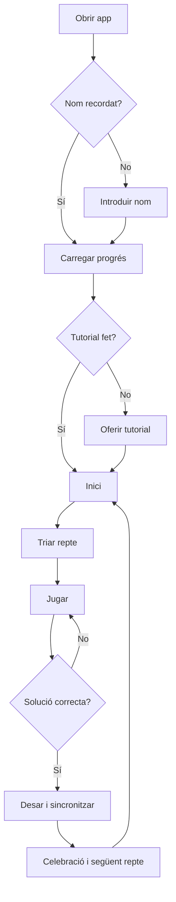

# Especificació completa per desenvolupar una app de Tantrix Discovery individual

**Versió del document:** 1.2.0
**Data:** 19 d’agost de 2026
**Públic destinatari:** programació, disseny UX/UI, il·lustració vectorial, proves i administració del Google Sheets
**Estat:** especificació funcional i tècnica preparada per implementar
**Idioma inicial de l’app:** català

> **Objectiu d’aquest document**
> Aquest document ha de ser la font principal de veritat del projecte. El programador no ha d’improvisar les regles, els controls, la progressió, el rànquing, l’estructura de dades ni les adaptacions responsive. Si durant el desenvolupament apareix una contradicció, s’ha de prioritzar, per aquest ordre: correcció de les regles, jugabilitat tàctil, accessibilitat, claredat visual, preservació del progrés i estètica.

---

## 1. Resum executiu

Cal crear una aplicació web progressiva (PWA), individual i instal·lable, inspirada en el **Tantrix Discovery** de deu fitxes. Ha de funcionar especialment bé en:

- mòbils, tant verticals com horitzontals;
- tauletes;
- ordinadors amb ratolí;
- ordinadors amb pantalla tàctil;
- dispositius híbrids en què es pot alternar ratolí, dit i llapis digital durant una mateixa partida.

El jugador introdueix únicament un **nom d’usuari**, sense correu electrònic, contrasenya ni PIN. L’app recupera el seu progrés d’un Google Sheets privat a través d’una aplicació web de Google Apps Script. El joc també ha de funcionar temporalment sense connexió i sincronitzar els resultats quan la connexió torni.

El repte comença amb les fitxes 1, 2 i 3. El jugador ha de construir un circuit tancat d’un color determinat, fent coincidir també tots els altres colors dels costats en contacte. Després incorpora la fitxa 4, després la 5, i així successivament fins a arribar a les deu fitxes. Amb les deu fitxes hi ha tres reptes finals: circuit vermell, circuit blau i circuit groc.

La qualitat del projecte es mesurarà sobretot per:

1. la facilitat amb què les fitxes es poden seleccionar, girar, arrossegar i encaixar;
2. la claredat de les instruccions visuals i del tutorial interactiu;
3. la coherència entre ratolí, tacte i teclat;
4. la correcció del validador de solucions;
5. la recuperació fiable del progrés;
6. una estètica neta, càlida i fidel a l’experiència física de manipular fitxes.

---

## 2. Abast del projecte

### 2.1. Funcionalitats obligatòries de la primera versió

- Joc individual amb les deu fitxes del Tantrix Discovery.
- Deu reptes progressius.
- Nom d’usuari sense PIN.
- Recuperació del progrés des de qualsevol dispositiu mitjançant el mateix nom.
- Historial de reptes superats en un Google Sheets privat.
- Rànquing visual agrupat pel nombre de reptes superats.
- Tutorial inicial interactiu.
- Guia visual consultable en qualsevol moment.
- Joc autèntic sense pistes, atenuació de colors, col·locació automàtica ni indicacions de proximitat a la solució.
- Selecció, rotació, arrossegament, encaix magnètic i moviment sense arrossegar.
- Historial intern amb dreceres de teclat per desfer i refer, més reinici, centrat i zoom; `Desfés` i `Refés` no ocupen espai a la interfície visible.
- Detecció automàtica d’una solució correcta.
- Desat local automàtic després de cada moviment.
- Funcionament PWA i suport bàsic fora de línia.
- Disseny responsive específic per a mòbil, tauleta i ordinador.
- Accessibilitat de teclat, focus visible, text escalable i alternativa als gestos.
- Proves automàtiques del motor, el validador, el rànquing i la normalització dels noms.

### 2.2. Funcionalitats expressament fora d’abast

- Partides multijugador.
- Sales, xat o presència en línia.
- Robots o intel·ligència artificial rival.
- Pagaments, anuncis o compres dins de l’app.
- Registre amb correu electrònic.
- Contrasenya o PIN.
- Cronòmetre com a criteri de rànquing.
- Penalització competitiva per demanar pistes.
- Qualsevol sistema de pistes o ajuda que reveli una part de la solució.
- Generació procedural de nous puzles en la primera versió.
- Tauler del Tantrix Strategy de 56 fitxes.
- Google Analytics o altres rastrejadors de tercers.

### 2.3. Principis no negociables

- El full de càlcul ha de romandre privat.
- El navegador no pot llegir ni escriure directament al Google Sheets.
- Google Apps Script ha de validar qualsevol resultat abans de registrar-lo.
- Cap funció essencial no pot dependre exclusivament d’arrossegar, fer doble clic, clicar amb el botó dret, mantenir premut o pessigar.
- Els controls tàctils no s’han d’eliminar en pantalles grans: un ordinador pot tenir pantalla tàctil.
- La interfície no ha de dependre només del color per comunicar errors, seleccions o progrés.
- Les imatges de les instruccions han de coincidir exactament amb el joc real.

---

## 3. Identificació del joc i fonts autoritzades d’informació

### 3.1. Quin joc s’està digitalitzant

El projecte correspon al **Tantrix Discovery**, no al Tantrix Strategy multijugador ni al Tantrix Xtreme.

El Tantrix va ser creat per Mike McManaway i és publicat per **Colour of Strategy Ltd**, de Nova Zelanda. El Discovery és una modalitat solitària de deu fitxes numerades. El jugador comença amb tres fitxes i n’afegeix una a cada nou repte.

### 3.2. Fonts principals

El programador ha de consultar aquestes fonts abans de modificar qualsevol regla o fitxa:

- [Regles oficials del Tantrix Discovery](https://www.tantrix.com/english/TantrixPuzzleRules.html)
- [Descripció oficial dels puzles i colors](https://www.tantrix.com/english/TantrixPuzzles.html)
- [Índex oficial de les 56 fitxes i seqüències cromàtiques](https://www.tantrix.com/english/TantrixTiles.html)
- [Productes i modalitats oficials](https://www.tantrix.com/english/TantrixProducts.html)
- [Equip i empresa editora](https://www.tantrix.com/english/TantrixTeam.html)
- [Contacte de Colour of Strategy Ltd](https://www.tantrix.com/english/TantrixFeedback.shtml)
- [Guia matemàtica educativa del Tantrix Discovery, NRICH](https://nrich.maths.org/games/tantrix-discovery)

### 3.3. Nota sobre el Tantrix Xtreme

No s’han de barrejar les dades del Discovery i de l’Xtreme. En el Discovery estàndard, el color imprès al número de la nova fitxa determina el repte oficial de 3 a 9 fitxes. Amb 10 fitxes hi ha un repte vermell, un de blau i un de groc. La documentació oficial també indica que el conjunt de 7 fitxes admet un circuit blau alternatiu, però el repte Discovery oficial continua sent el vermell. L’app ha de validar el color del `challengeId` actiu i no convertir colors alternatius en reptes addicionals.

---

## 4. Drets d’ús, marca i actius oficials

### 4.1. Bloqueig legal previ a una publicació pública

El nom **Tantrix**, el logotip, les il·lustracions, els textos oficials i les imatges de les fitxes pertanyen als seus titulars. El web oficial indica “All rights reserved”.

Abans de publicar una app que utilitzi públicament el nom Tantrix, les deu fitxes exactes o l’aspecte oficial, el responsable del projecte ha d’obtenir autorització escrita de **Colour of Strategy Ltd**. El correu de contacte publicat és `info@colourofstrategy.com`.

Aquest punt s’ha de tractar com el bloqueig `LEGAL-01`:

- Un prototip intern pot avançar amb actius provisionals.
- No s’ha de presentar com a app oficial sense permís.
- No s’ha de publicar en botigues d’apps ni distribuir comercialment fins a aclarir els drets.
- El repositori no ha d’incloure logotips ni il·lustracions oficials sense documentar-ne la llicència.

### 4.2. Imatges oficials de referència

L’índex oficial ofereix petits PNG de 32 × 28 píxels. Serveixen per verificar el patró de cada fitxa, però són massa petits per a una app moderna i no s’han d’ampliar per a producció.

Referències de les deu fitxes:

1. `https://www.tantrix.com/images/TantrixTiles/TantrixTile01.png`
2. `https://www.tantrix.com/images/TantrixTiles/TantrixTile02.png`
3. `https://www.tantrix.com/images/TantrixTiles/TantrixTile03.png`
4. `https://www.tantrix.com/images/TantrixTiles/TantrixTile04.png`
5. `https://www.tantrix.com/images/TantrixTiles/TantrixTile05.png`
6. `https://www.tantrix.com/images/TantrixTiles/TantrixTile06.png`
7. `https://www.tantrix.com/images/TantrixTiles/TantrixTile07.png`
8. `https://www.tantrix.com/images/TantrixTiles/TantrixTile08.png`
9. `https://www.tantrix.com/images/TantrixTiles/TantrixTile09.png`
10. `https://www.tantrix.com/images/TantrixTiles/TantrixTile10.png`

Índex complet de referència:

`https://www.tantrix.com/images/TileIndex2021.png`

No s’han d’enllaçar aquestes imatges en calent des de l’app. Si hi ha autorització per usar-les com a referència interna, s’han de descarregar una sola vegada, conservar fora de la versió pública i registrar-ne la procedència.

### 4.3. Actiu recomanat per a producció

Les fitxes de producció s’han de generar en **SVG vectorial** a partir de les seqüències de costats definides en aquest document. Això permet:

- nitidesa a qualsevol escala;
- colors controlats;
- animacions suaus;
- mode d’alt contrast;
- patrons d’accessibilitat;
- un sol motor visual per al joc, les instruccions i el tutorial.

La generació vectorial no elimina per si mateixa la necessitat d’aclarir els drets sobre el conjunt de fitxes i la marca.

---

## 5. Regles exactes del joc

### 5.1. Objectiu general

En cada repte s’han d’utilitzar totes les fitxes disponibles, de la 1 fins al nombre indicat. Cal construir un **únic circuit tancat** del color objectiu que passi per totes les fitxes.

A més:

- tots els costats de fitxes que es toquen han de mostrar el mateix color;
- les fitxes han de formar un únic conjunt connectat;
- no es poden superposar;
- no es poden deixar forats interiors;
- el circuit objectiu ha de ser continu, tancat i incloure totes les fitxes del repte;
- les fitxes es poden girar en increments de 60 graus;
- la forma exterior de la composició és lliure.

### 5.2. Definició de circuit

Un circuit és una línia d’un sol color que:

1. entra i surt de cada fitxa que recorre;
2. continua a través de costats adjacents del mateix color;
3. torna al punt d’inici;
4. no té cap extrem obert;
5. forma una sola component, no dos circuits separats.

### 5.3. Progressió oficial

| Ordre | ID intern | Fitxes disponibles | Color objectiu | Etiqueta visible |
|---:|---|---:|---|---|
| 1 | `D03_Y` | 1–3 | groc | 3 peces |
| 2 | `D04_R` | 1–4 | vermell | 4 peces |
| 3 | `D05_R` | 1–5 | vermell | 5 peces |
| 4 | `D06_B` | 1–6 | blau | 6 peces |
| 5 | `D07_R` | 1–7 | vermell | 7 peces |
| 6 | `D08_B` | 1–8 | blau | 8 peces |
| 7 | `D09_Y` | 1–9 | groc | 9 peces |
| 8 | `D10_R` | 1–10 | vermell | 10 · vermell |
| 9 | `D10_B` | 1–10 | blau | 10 · blau |
| 10 | `D10_Y` | 1–10 | groc | 10 · groc |

L’ordre dels tres reptes finals ha de ser vermell, blau i groc, de més accessible a més difícil segons la informació oficial.

Constant canònica recomanada:

```js
export const CHALLENGE_DEFINITIONS = Object.freeze([
  { id: "D03_Y", order: 1, pieceCount: 3, targetColor: "Y" },
  { id: "D04_R", order: 2, pieceCount: 4, targetColor: "R" },
  { id: "D05_R", order: 3, pieceCount: 5, targetColor: "R" },
  { id: "D06_B", order: 4, pieceCount: 6, targetColor: "B" },
  { id: "D07_R", order: 5, pieceCount: 7, targetColor: "R" },
  { id: "D08_B", order: 6, pieceCount: 8, targetColor: "B" },
  { id: "D09_Y", order: 7, pieceCount: 9, targetColor: "Y" },
  { id: "D10_R", order: 8, pieceCount: 10, targetColor: "R" },
  { id: "D10_B", order: 9, pieceCount: 10, targetColor: "B" },
  { id: "D10_Y", order: 10, pieceCount: 10, targetColor: "Y" },
]);
```

### 5.4. Desbloqueig

- El repte de 3 peces està disponible des del principi.
- Durant la primera progressió només es pot jugar el repte actual.
- Cada repte desbloqueja el següent únicament després d’haver estat resolt i desat localment.
- No es pot saltar, seleccionar ni jugar cap repte futur.
- Els tres colors de 10 peces es desbloquegen successivament: vermell, blau i groc.
- Quan s’han completat les deu fites, s’activa el selector complet i es pot tornar a jugar qualsevol repte.
- Repetir un repte després de completar tot el Discovery no redueix ni altera el progrés i no crea cap escriptura nova al servidor.

---

## 6. Especificació exacta de les deu fitxes

### 6.1. Model de dades

Cada fitxa és un hexàgon regular de base plana. Té sis costats. Cada color apareix exactament dues vegades i aquestes dues sortides estan unides per una línia dins de la fitxa.

S’utilitzen tres colors:

- `R`: vermell;
- `B`: blau;
- `Y`: groc.

La seqüència s’ha de llegir en sentit horari. El punt d’inici gràfic és arbitrari sempre que sigui consistent, perquè qualsevol orientació base es pot obtenir mitjançant rotació.

### 6.2. Seqüències oficials

| Fitxa | Seqüència horària de costats | Parelles de colors derivades |
|---:|---|---|
| 1 | `YYBRBR` | Y: 0–1 · B: 2–4 · R: 3–5 |
| 2 | `YYBRRB` | Y: 0–1 · B: 2–5 · R: 3–4 |
| 3 | `RRBBYY` | R: 0–1 · B: 2–3 · Y: 4–5 |
| 4 | `YRBRYB` | Y: 0–4 · R: 1–3 · B: 2–5 |
| 5 | `YYRBBR` | Y: 0–1 · R: 2–5 · B: 3–4 |
| 6 | `RBYBRY` | R: 0–4 · B: 1–3 · Y: 2–5 |
| 7 | `BBYRYR` | B: 0–1 · Y: 2–4 · R: 3–5 |
| 8 | `BBRYRY` | B: 0–1 · R: 2–4 · Y: 3–5 |
| 9 | `YBRBYR` | Y: 0–4 · B: 1–3 · R: 2–5 |
| 10 | `YYRBRB` | Y: 0–1 · R: 2–4 · B: 3–5 |

Aquestes seqüències provenen de l’índex oficial. Els tests han de comprovar-les literalment. La taula explicita també les parelles perquè una errada de transcripció —especialment a la fitxa 6— no torni a generar un dibuix incorrecte.

### 6.3. Constant canònica recomanada

```js
export const TILE_DEFINITIONS = Object.freeze([
  { id: 1, edges: "YYBRBR" },
  { id: 2, edges: "YYBRRB" },
  { id: 3, edges: "RRBBYY" },
  { id: 4, edges: "YRBRYB" },
  { id: 5, edges: "YYRBBR" },
  { id: 6, edges: "RBYBRY" },
  { id: 7, edges: "BBYRYR" },
  { id: 8, edges: "BBRYRY" },
  { id: 9, edges: "YBRBYR" },
  { id: 10, edges: "YYRBRB" },
]);
```

### 6.4. Sistema de rotació

La rotació s’emmagatzema com un enter `0..5`.

```js
function colorAtWorldEdge(tile, rotation, worldEdge) {
  const sourceEdge = (worldEdge - rotation + 6) % 6;
  return tile.edges[sourceEdge];
}
```

- `rotation = 0`: orientació base.
- `rotation = 1`: 60° en sentit horari.
- `rotation = 5`: 60° en sentit antihorari.
- No s’han de desar angles de coma flotant.

### 6.5. Coordenades hexagonals

S’han d’utilitzar coordenades axials enteres `(q, r)` per evitar errors d’alineació.

Ordre canònic de veïns, començant a la dreta i seguint en sentit horari:

```js
export const HEX_DIRECTIONS = Object.freeze([
  [ 1,  0], // 0: dreta
  [ 0,  1], // 1: baix-dreta
  [-1,  1], // 2: baix-esquerra
  [-1,  0], // 3: esquerra
  [ 0, -1], // 4: dalt-esquerra
  [ 1, -1], // 5: dalt-dreta
]);

export const oppositeEdge = edge => (edge + 3) % 6;
```

Conversió recomanada a píxels per a hexàgons de base plana:

```js
function axialToPixel(q, r, radius) {
  return {
    x: radius * 1.5 * q,
    y: radius * Math.sqrt(3) * (r + q / 2),
  };
}
```

### 6.6. Renderització vectorial

Cada fitxa ha de ser un grup SVG amb:

1. hexàgon base negre;
2. vora exterior subtil;
3. ombra o elevació aplicada al grup, no rasteritzada;
4. tres camins de color amb extrems plans exactament sobre el punt mitjà del costat;
5. hit area transparent lleugerament més gran que l’hexàgon visible;
6. anell de selecció separat;
7. indicador opcional del número de fitxa, només en modes d’ajuda o depuració.

Els camins s’han de generar unint els punts mitjans dels dos costats que comparteixen color amb la geometria circular del joc real:

- hexàgon de radi `R` i apotema `R · cos(30°)`;
- corba tancada entre costats consecutius: arc circular de radi `R / 2`;
- corba oberta entre costats separats per un costat: arc circular de radi `3R / 2`;
- connexió entre costats oposats: segment recte;
- extrems `butt`, sense bonys rodons fora de l’hexàgon;
- vora exterior pintada després dels camins;
- ordre de pintat explícit per fitxa perquè els encreuaments coincideixin amb la referència oficial.

No s’han d’aproximar les corbes amb una Bézier genèrica ni deduir el dibuix només en temps de renderització. `TILE_DEFINITIONS` ha d’incloure, per a cada camí, `color`, `from`, `to` i `shape` (`tight`, `wide` o `straight`), i els tests han de comprovar que els dos extrems tenen el color declarat.

No s’han de crear deu SVG independents dibuixats a mà. S’ha de crear un únic component `TileRenderer` alimentat per `TILE_DEFINITIONS`.

---

## 7. Arquitectura de l’experiència

### 7.1. Pantalles principals

1. **Càrrega curta**: logotip provisional i restauració local.
2. **Identificació**: entrada o selecció del nom d’usuari.
3. **Inici**: continuar, triar repte, tutorial, guia i rànquing.
4. **Tutorial interactiu**.
5. **Joc**.
6. **Repte superat**.
7. **Rànquing**.
8. **Guia visual**.
9. **Configuració i accessibilitat**.
10. **Estat de sincronització**.

### 7.2. Flux principal



### 7.3. Pantalla d’identificació

Text principal:

> **Com et vols dir en el joc?**

Text secundari:

> Escriu un nom d’usuari. El farem servir per recuperar el teu progrés i mostrar-lo al rànquing.

Controls:

- camp de text;
- botó `Comença`;
- en dispositius compartits, llista opcional dels darrers quatre noms desats localment;
- avís breu: “No hi ha contrasenya. Qualsevol persona que escrigui el mateix nom podrà continuar aquest progrés.”

No s’ha de demanar cap dada personal addicional.

### 7.4. Pantalla d’inici

Ha de mostrar:

- cap salutació redundant: el nom del jugador només apareix a la capçalera;
- progrés `x/10 reptes`;
- nivell més alt visible;
- distintius dels tres colors de deu peces;
- botó principal `Continua`;
- recorregut visual dels reptes, amb els futurs clarament bloquejats;
- accessos a `Com es juga`, `Tutorial`, `Rànquing` i `Canvia de jugador`;
- estat discret de sincronització.

En ordinador aquesta pantalla funciona com un tauler de navegació compacte: títol contingut, targeta principal d’uns 218 px, nodes de repte d’uns 76 px i marges reduïts.

Els estats dels reptes es diferencien simultàniament per color, icona i contorn, sense les etiquetes visibles `Fet`, `Ara` o `Pendent`. Un distintiu circular situat a la cantonada superior dreta mostra, respectivament, un tic verd, un símbol de reproducció groc o un cadenat gris. L’estat complet es conserva a l’etiqueta accessible de cada repte i el color d’estat no substitueix el punt del color objectiu.

El botó `Continua` reprèn la partida incompleta del repte actual. Si no n’hi ha cap, inicia el primer repte pendent. El selector lliure de reptes només apareix després d’haver completat les deu fites.

### 7.5. Indicadors del repte

La pantalla de joc no ha de descriure l’objectiu amb una frase com “Construeix un circuit vermell amb 7 fitxes”. Ha de mostrar:

1. les `N` fitxes reals disponibles, renderitzades a la safata;
2. un indicador numèric independent amb etiqueta i valor, per exemple `Fitxes · 7`;
3. un indicador cromàtic independent amb mostra de color, nom escrit i valor accessible, per exemple `Color · vermell`.

El color és una dada obligatòria del repte Discovery, no una pista. Els dos indicadors han de ser visibles alhora, compactes i comprensibles sense dependre només del color.

---

## 8. Sistema de controls multimodal

### 8.1. Decisió principal

No s’ha d’assignar la rotació al primer toc sobre una fitxa, perquè impediria seleccionar-la i moure-la sense alterar-ne l’orientació. El sistema obligatori és:

- **primer toc o clic sobre una fitxa:** seleccionar-la;
- **toc o clic posterior sobre la mateixa fitxa seleccionada:** girar-la 60° a la dreta;
- **arrossegar una fitxa:** moure-la, sense girar-la;
- **seleccionar una fitxa i tocar una cel·la buida:** moure-la sense arrossegar;
- **botons visibles `↶ Esquerra` i `↷ Dreta`:** girar en qualsevol direcció sense dependre d’una icona sola;
- **clic dret:** drecera opcional per girar a l’esquerra;
- **tecles `Q` i `E`:** dreceres opcionals per girar a esquerra i dreta.

Els botons visibles són sempre l’opció canònica. Les dreceres no poden ser necessàries per completar el joc.

### 8.2. Per què no s’ha d’usar el doble clic

El doble clic o doble toc no s’ha d’assignar a cap funció essencial perquè:

- obliga a retardar la resposta del primer clic;
- és menys fiable en pantalles tàctils;
- pot activar zoom o gestos del navegador;
- es confon fàcilment amb dos girs;
- és difícil de descobrir.

Es pot ignorar o tractar exactament com dos clics simples sobre una fitxa ja seleccionada.

### 8.3. Màquina de gestos

En `pointerdown`:

1. registrar `pointerId`, posició, hora i fitxa;
2. capturar el punter amb `setPointerCapture`;
3. entrar en estat `PENDING`.

En `pointermove`:

- si la distància supera **8 CSS px**, entrar en `DRAGGING`;
- mostrar la previsualització de la fitxa i la cel·la candidata;
- no iniciar un segon gest amb el mateix punter.

En `pointerup`:

- si estava en `PENDING`, executar selecció o rotació;
- si estava en `DRAGGING`, encaixar o retornar;
- alliberar la captura;
- impedir que el navegador generi un `click` addicional.

En `pointercancel`:

- retornar la fitxa a l’estat anterior;
- netejar el gest sense modificar l’historial.

S’ha d’utilitzar **Pointer Events**, no implementacions separades de mouse i touch.

### 8.4. Arrossegament

Durant l’arrossegament:

- la fitxa s’eleva visualment;
- augmenta lleugerament, màxim un 4%;
- mostra ombra;
- la cel·la hexagonal candidata es ressalta;
- en un punter tàctil gruixut, la fitxa es mostra aproximadament mitja fitxa per sobre del dit;
- l’estat original no es modifica fins al `pointerup`;
- si la cel·la està ocupada, es mostra el símbol de bloqueig i la fitxa torna al lloc anterior;
- si la cel·la és lliure, s’hi encaixa exactament.

Quan l’arrossegament comença a la safata amb un punter tàctil, la previsualització flotant ha de ser compacta —aproximadament 68 × 68 CSS px— i clarament més petita que la fitxa ja situada al tauler. No pot tapar la cel·la candidata ni impedir veure amb precisió on s’alliberarà.

Les connexions cromàtiques incorrectes **no han d’impedir provisionalment** deixar una fitxa i **no s’han de marcar visualment**. L’app només valida la composició completa quan totes les fitxes són al tauler, automàticament o mitjançant el botó visible `✓ Comprova`; si no és vàlida, mostra el missatge neutre “Encara no està resolt”. Això permet experimentar com amb les peces físiques sense convertir la interfície en una pista.

### 8.5. Moviment sense arrossegar

Per complir accessibilitat i facilitar l’ús en pantalles petites:

1. tocar o clicar una fitxa;
2. la fitxa queda seleccionada;
3. tocar o clicar una cel·la lliure;
4. la fitxa es mou a aquella cel·la.

La cel·la ha de tenir una hit area generosa, encara que la quadrícula sigui invisible.

### 8.6. Rotació

- Cada gir és de 60°.
- La rotació ha de durar entre 120 i 180 ms.
- Ha de respectar `prefers-reduced-motion`.
- Els botons de gir `Esquerra` i `Dreta` han de ser com a mínim de 48 × 48 CSS px, mostrar text visible i tenir icones SVG inequívocament diferents: una fitxa hexagonal amb una fletxa circular cap al costat corresponent. `Esquerra` usa violeta i `Dreta` blau per facilitar-ne la identificació immediata.
- En mòbil han d’estar fixos a la barra inferior.
- En tauleta i ordinador poden ser a la barra lateral, però no s’han d’amagar.
- El clic dret només s’ha d’interceptar sobre les fitxes, no a tota l’app.

### 8.7. Tauler, desplaçament i zoom

- Arrossegar una zona buida mou el tauler.
- Pessigar amb dos dits amplia o redueix.
- La roda del ratolí amb `Ctrl` o sobre el tauler pot controlar el zoom; sense `Ctrl`, s’ha de respectar el comportament de la pàgina quan pertoqui.
- Sempre hi ha botons amb icona SVG i text: `Allunya`, `Centra` i `Apropa`.
- La graella es limita a 19 cel·les per als reptes de 3–4 fitxes, 37 per als de 5–8 i 61 per als de 9–10; aquestes extensions admeten totes les solucions oficials i eviten corones visuals innecessàries.
- Escala mínima: 0,65.
- Escala màxima: 1,80.
- `Centrar` calcula el bounding box de les fitxes i l’ajusta amb un marge mínim del 12%.
- Quan es resol un repte, la composició es centra abans de la celebració.

### 8.8. Safata de fitxes

- Conté totes les fitxes no col·locades.
- En mòbil és una graella vertical compacta i desplaçable que deixa visibles les tres primeres fitxes.
- En tauleta pot ocupar dues files.
- En ordinador pot ser una graella lateral.
- Les fitxes s’inicien en ordre aleatori i amb rotació aleatòria, però mai en una solució completa.
- Seleccionar una fitxa de la safata i tocar el tauler l’hi col·loca.
- Una fitxa del tauler pot tornar a la safata arrossegant-la. `Reinicia` retorna totes les fitxes de cop.

### 8.9. Desfer i refer

- Historial local mínim de 100 accions.
- L’historial es conserva com a mecanisme intern i és accessible amb les dreceres de teclat, però no mostra botons `Desfés` ni `Refés` al panell de joc.
- Una acció és: moure, girar, retornar a safata o reiniciar.
- Un arrossegament complet és una sola acció.
- El zoom i el desplaçament de càmera no entren a l’historial del joc.
- `Reinicia` demana confirmació només si hi ha canvis.

### 8.10. Comprovació i sortida

- `✓ Comprova` és sempre visible i és l’acció principal del panell de controls.
- `Comprova` i `Reinicia` ocupen junts l’última fila del panell, tenen exactament la mateixa mida i una separació clara respecte dels controls de gir.
- Si falten fitxes, només indica quantes falten per col·locar.
- Si la composició completa no és vàlida, mostra `Encara no està resolt` sense pistes parcials.
- Si és vàlida, mostra immediatament `Repte superat!` i el botó `Següent repte`.
- La capçalera de joc mostra sempre el botó textual `Surt` al seu extrem dret, amb icona SVG de sortida; abans de tornar a l’inici desa la partida local.

---

## 9. Triple disseny responsive

### 9.1. Regla general

El disseny s’ha d’adaptar a l’espai disponible, no al nom del dispositiu. S’han d’utilitzar breakpoints i, si és possible, container queries. Les funcions tàctils han d’estar disponibles en tots els breakpoints.

Breakpoints inicials:

- **compacte / mòbil:** menys de 600 px;
- **mitjà / tauleta:** 600–1023 px;
- **ampli / ordinador:** 1024 px o més.

També s’han de provar alçades petites, orientació horitzontal i zoom del navegador al 200%.

### 9.2. Mòbil

Estructura vertical:

1. capçalera compacta de 52–56 px;
2. franja d’objectiu de 44–52 px;
3. tauler flexible ocupant la major part de `100dvh`;
4. safata de fitxes de 92–116 px;
5. barra d’accions de 60–72 px respectant `safe-area-inset-bottom`.

Requisits:

- cap botó essencial dins d’un menú ocult;
- fitxes visibles d’un mínim aproximat de 58 px d’amplada quan sigui possible;
- safata vertical compacta amb les primeres fitxes visibles i desplaçament intern si cal;
- panell d’objectiu plegable si l’alçada és molt petita;
- instruccions en modal a pantalla completa;
- retrat i paisatge funcionals;
- no provocar scroll accidental mentre es manipula el tauler.

### 9.3. Tauleta

En vertical:

- capçalera superior;
- objectiu i progrés en una franja;
- tauler central;
- safata inferior en una o dues files;
- barra de controls inferior o lateral curta.

En horitzontal:

- panell esquerre de 180–230 px amb objectiu i progrés, prioritzant la lectura completa en alçades petites;
- tauler al centre;
- safata i controls a la dreta o a la part inferior segons l’alçada.

Les fitxes haurien de tenir entre 72 i 92 px d’amplada en condicions habituals.

### 9.4. Ordinador

Estructura recomanada:

- columna esquerra de 300–320 px: indicadors de fitxes i color en targetes, progrés d’alt contrast i ajuda de controls;
- zona central flexible: tauler;
- columna dreta de 260–320 px: safata i controls; amb 7–10 fitxes, la safata redueix progressivament peces i espais, disposa de scroll intern si cal i reserva sempre la zona completa dels botons;
- al menú, marca principal ampliada i botó textual `Inici` a l’extrem dret; `Inici` tanca la sessió activa i torna a la portada d’accés sense eliminar cap progrés local;
- a `Com es juga`, `Tutorial`, `Rànquing` i `Configuració`, el botó dret és `Torna`, amb fletxa enrere, i retorna al menú sense tancar la sessió;
- al joc, capçalera compacta amb `Surt`.

Requisits:

- no dependre del `hover`;
- tots els botons tàctils continuen visibles;
- fitxes d’entre 84 i 112 px segons la pantalla;
- suport de ratolí, teclat, dit i llapis;
- el canvi de mètode d’entrada no requereix recarregar.

### 9.5. Ordinador amb pantalla tàctil

S’ha de comportar com la versió d’ordinador pel que fa a distribució, però com la versió tàctil pel que fa a hit areas, gestos i botons. No s’han de detectar dispositius per user agent. Es pot usar `pointer: coarse` per augmentar espais, mai per retirar funcions.

---

## 10. Disseny visual i estètica

### 10.1. Concepte visual

L’app ha de transmetre la sensació d’un joc de taula elegant sobre una superfície tranquil·la. Les fitxes són el centre visual. La interfície ha de ser sòbria, càlida i contemporània, no una imitació d’un videojoc arcade.

Paraules clau:

- tàctil;
- net;
- amable;
- precís;
- lúdic però no infantilitzat;
- accessible;
- sense decoració que competeixi amb els circuits.

### 10.2. Paleta inicial

| Ús | Color proposat |
|---|---|
| Fons general | `#F4F1E8` |
| Superfície | `#FFFFFF` |
| Text principal | `#1A1D21` |
| Text secundari | `#5B6470` |
| Fitxa | `#0C0E10` |
| Vermell Tantrix | `#E50000` |
| Blau Tantrix | `#008FCC` |
| Groc Tantrix | `#F2CA00` |
| Èxit UI | `#247A46` |
| Error UI | `#B42318` |
| Focus | `#6D5BD0` |

Els colors de les fitxes prenen com a referència els PNG oficials, però s’han de validar en dispositius reals i amb contrast suficient. El groc sempre ha d’aparèixer sobre fons fosc o amb contorn.

### 10.3. Tipografia

- Preferència: `system-ui`, `-apple-system`, `Segoe UI`, `Roboto`, `Arial`, sans-serif.
- No dependre d’una font remota per funcionar.
- Cos mínim: 16 px.
- Marca `Tantrix Discovery`: aproximadament 24–25 px en mòbil i 28–29 px en pantalles grans, amb replegament segur al 200%.
- Etiquetes de controls: 11–16 px segons l’espai, sempre acompanyades d’icona quan cal.
- Títols de pantalla: més continguts que la portada, entre 32 i 57 px segons breakpoint.
- Interlineat mínim del cos: 1,45.
- No usar només majúscules en instruccions llargues.

### 10.4. Components

- Cantonades de panells: 14–18 px.
- Ombres molt suaus.
- Botons primaris plens; secundaris contornejats i codificació semàntica consistent: verd per comprovar, blau per vista, violeta per girar, ambre per retornar i vermell per sortir o reiniciar.
- Icones SVG de traç arrodonit.
- Focus de teclat molt visible.
- Cap control important representat només per una icona: ha de tenir text visible i `aria-label` quan el text abreujat no sigui suficient.

### 10.5. Animació

- Gir de fitxa: 120–180 ms.
- Encaix: 140–220 ms.
- Retorn d’una fitxa: 180–240 ms.
- Celebració: màxim 1,5 s i no bloquejant.
- No usar animacions contínues.
- Amb `prefers-reduced-motion`, substituir moviments per canvis d’opacitat breus.

### 10.6. Peu de pàgina i llicència

El peu de pàgina ha de seguir la convenció comuna de les apps del projecte:

- disposició compacta en una sola fila sempre que hi hagi espai;
- distintiu `CC BY-NC-SA 4.0` immediatament a l’esquerra;
- exactament dues línies de text a la dreta;
- primera línia: `Creada per Felip Sarroca amb assistència d’IA`;
- segona línia: `Obra sota llicència CC BY-NC-SA 4.0`;
- enllaços a `https://ja.cat/felipsarroca` i a la llicència en català;
- els enllaços mantenen color i pes diferenciats, però no mostren subratllat;
- distintiu, text i espaiat ocupen aproximadament un 70% de la mida del peu original, amb interlineat intermedi entre la separació inicial i la versió més compacta;
- mida petita però llegible, sense provocar desbordament amb zoom de text del 200%.

La llicència s’aplica al codi i als continguts originals del projecte; no altera els drets de la marca Tantrix ni dels actius de tercers.

---

## 11. Guia visual i tutorial

### 11.1. Principi general

Les instruccions no poden ser un bloc de text. Han de combinar:

- una frase curta;
- una il·lustració vectorial gran;
- comparacions correctes/incorrectes;
- animacions breus quan el moviment sigui rellevant;
- text alternatiu equivalent.

Totes les imatges s’han de generar amb el mateix `TileRenderer` del joc. No s’han d’usar captures antigues, imatges pixelades ni il·lustracions aproximades creades per IA.

### 11.2. Diagrames visuals obligatoris

La guia utilitza sis diagrames SVG responsius i específics, generats dins l’aplicació. No es reutilitza una fitxa aïllada com a il·lustració genèrica. Les peces Tantrix reals es dibuixen amb el mateix `TileRenderer` del joc; els esquemes de conceptes no mostren cap solució real.

| Targeta | Demostració visual |
|---|---|
| `Tres camins` | Una fitxa gran amb els camins vermell, blau i groc assenyalats individualment. |
| `Fes coincidir els colors` | Dues peces diferents de les inicials, ben encaixades, amb el contacte blau-blau ampliat i un tic. |
| `Gira i mou` | Fitxa seleccionada, dos controls de gir, trajecte discontinu, cel·la candidata, toc i mà. |
| `Tanca un únic circuit` | Diverses peces esquemàtiques ben col·locades i un únic recorregut groc tancat que passa per totes. |
| `Utilitza-les totes` | Totes les peces unides al tauler, fletxa de finalització, safata a zero i tic. |
| `Sense forats` | Comparació simultània entre una corona amb cel·la buida i una composició compacta vàlida. |

### 11.3. Text i jerarquia de la guia

Les sis targetes són `Tres camins`, `Fes coincidir els colors`, `Gira i mou`, `Tanca un únic circuit`, `Utilitza-les totes` i `Sense forats`. Cada text explica exactament el diagrama contigu. Els conceptes crítics es destaquen amb color, negreta o una pastilla semàntica: els tres colors, `exactament el mateix color`, els dos girs, `toca una cel·la`, `totes les fitxes`, `safata marca 0` i `no poden envoltar una cel·la buida`.

Els controls de gir es representen amb les mateixes icones SVG de l’aplicació, no amb glifs solts. El toc combina una diana, una mà i l’etiqueta `TOCA`. Cada diagrama disposa d’una descripció accessible equivalent mitjançant `role="img"` i `aria-label`.

### 11.4. Tutorial interactiu obligatori

El tutorial ha de durar aproximadament dos minuts i tenir aquests passos:

| Pas | Instrucció | Acció esperada | Validació |
|---:|---|---|---|
| 1 | “Toca aquesta fitxa per seleccionar-la.” | seleccionar | anell visible |
| 2 | “Fes-la girar a la dreta.” | `↷` o segon toc | rotació +1 |
| 3 | “Ara gira-la a l’esquerra.” | `↶` | rotació −1 |
| 4 | “Arrossega-la fins a la zona marcada.” | drag & drop | cel·la correcta |
| 5 | “També pots moure sense arrossegar.” | seleccionar + tocar cel·la | posició correcta |
| 6 | “Uneix blau amb blau.” | col·locar una fitxa de pràctica | costat coincident |
| 7 | “Ja tens els controls.” | confirmar final del tutorial | tutorial complet |

Requisits:

- botó `Omet el tutorial`;
- botó `Torna-ho a veure` a la configuració;
- focus guiat i lectura correcta amb lector de pantalla;
- no registrar el repte real fins que el jugador decideixi començar, llevat que es confirmi explícitament que el tutorial compta com a primer repte;
- recomanació: el tutorial no compta; el repte de 3 peces es fa després de manera autònoma.

### 11.5. Ajuda contextual

- La primera vegada que se selecciona una fitxa es pot mostrar una única explicació dels controls: “Torna-la a tocar per girar-la o fes servir ↶ i ↷”.
- L’ajuda contextual només explica controls; no interpreta la composició, no assenyala errors i no suggereix moviments.
- No mostrar el mateix missatge més d’una vegada.

---

## 12. Joc sense pistes

- No hi ha cap botó ni sistema de pistes.
- No s’atenuen colors ni es destaca el camí objectiu durant la partida.
- No es revela si una forma s’aproxima a una solució.
- No es col·loca, orienta ni suggereix cap fitxa.
- No es marquen automàticament els contactes incorrectes durant la construcció.
- Els indicadors `Fitxes` i `Color` són dades del repte oficial, no ajudes.
- La guia explica les regles i els controls, però no conté solucions.

---

## 13. Motor de joc i estat

### 13.1. Estat mínim d’una partida

```js
{
  challengeId: "D07_R",
  targetColor: "R",
  pieces: [
    { tileId: 1, location: "BOARD", q: 0, r: 0, rotation: 2 },
    { tileId: 2, location: "TRAY", q: null, r: null, rotation: 4 }
  ],
  selectedTileId: 1,
  startedAt: "2026-08-19T15:00:00.000Z",
  updatedAt: "2026-08-19T15:02:05.000Z"
}
```

### 13.2. Separació de capes

- `data`: definicions immutables de fitxes i reptes.
- `domain`: coordenades, rotacions, adjacències i validació.
- `state`: partida, progrés, historial undo/redo i sincronització.
- `render`: SVG i càmera.
- `interaction`: Pointer Events, teclat i gestos.
- `ui`: pantalles i components.
- `api`: comunicació amb Apps Script.
- `storage`: localStorage i IndexedDB.

La lògica de regles no pot dependre del DOM.

### 13.3. Desat automàtic local

Desar després de:

- cada moviment;
- cada rotació;
- sortir de la pantalla;
- passar a segon pla.

El nom i preferències simples poden anar a `localStorage`. Les partides, el progrés, els reptes superats i la cua de sincronització han d’anar a IndexedDB. Aquest desat local és la via principal i no pot esperar cap resposta de xarxa.

---

## 14. Validador de solucions

### 14.1. Doble validació

- **Client:** validació immediata quan totes les fitxes són al tauler, amb una resposta només binària (repte resolt o missatge neutre), mai amb pistes parcials.
- **Servidor:** mateixa validació independent abans d’escriure al Google Sheets.

Mai no s’ha de registrar un nivell basant-se només en `challengeId` o en un booleà enviat pel client.

### 14.2. Entrada del validador

```js
{
  challengeId: "D07_R",
  layout: [
    { tileId: 1, q: 0, r: 0, rotation: 2 },
    { tileId: 2, q: 1, r: 0, rotation: 5 }
  ]
}
```

### 14.3. Comprovacions obligatòries

1. `challengeId` existeix.
2. Nombre exacte de fitxes.
3. Conjunt exacte de `tileId`: `1..N`.
4. Sense duplicats.
5. Coordenades enteres dins d’un límit raonable, per exemple `-20..20`.
6. Rotacions enteres `0..5`.
7. Sense dues fitxes a la mateixa coordenada.
8. Conjunt connectat mitjançant BFS o DFS.
9. Tots els costats en contacte coincideixen.
10. Cap forat interior.
11. Cada fitxa participa en el circuit del color objectiu.
12. El circuit és únic i tancat.
13. El repte anterior està superat, excepte en replays.

### 14.4. Comprovació de colors adjacents

Per cada fitxa i cada costat:

1. calcular la coordenada veïna;
2. si hi ha fitxa veïna, comparar el color del costat amb el color del costat oposat;
3. processar cada parella una sola vegada.

### 14.5. Comprovació de connectivitat

- Iniciar BFS a la primera fitxa.
- Travessar qualsevol adjacència física entre fitxes.
- El nombre de visitades ha de ser `N`.

### 14.6. Comprovació de forats

1. Crear un bounding box axial ampliat dues cel·les.
2. Marcar totes les cel·les ocupades.
3. Fer flood fill des d’una cel·la exterior.
4. Qualsevol cel·la buida dins del bounding box no assolida des de l’exterior és un forat.
5. Si existeix un forat, la solució és invàlida.

### 14.7. Comprovació del circuit

Per cada fitxa:

- obtenir els dos costats del color objectiu després de la rotació;
- tots dos han de tocar una fitxa veïna amb el mateix color;
- traçar el camí des d’una fitxa inicial;
- cada transició ha d’entrar a la següent fitxa i sortir pel segon costat d’aquell color;
- el recorregut ha de tornar a l’inici després de visitar exactament `N` fitxes;
- no es permet tornar a l’inici abans d’haver-les visitat totes;
- no es permeten múltiples circuits separats.

### 14.8. Resposta del validador

```js
{
  valid: false,
  code: "OPEN_TARGET_PATH",
  details: {
    targetColor: "R",
    openEnds: [{ tileId: 4, edge: 2 }]
  }
}
```

Codis mínims:

- `VALID`
- `WRONG_TILE_SET`
- `DUPLICATE_TILE`
- `OVERLAP`
- `DISCONNECTED`
- `COLOR_MISMATCH`
- `HOLE`
- `OPEN_TARGET_PATH`
- `MULTIPLE_TARGET_LOOPS`
- `TARGET_NOT_USING_ALL_TILES`
- `CHALLENGE_LOCKED`
- `INVALID_PAYLOAD`

Els detalls complets s’utilitzen per depuració. Al jugador s’ha de mostrar un missatge senzill.

---

## 15. Feedback durant la partida

### 15.1. Construcció autèntica

Durant la construcció no es remarquen contactes incorrectes ni s’interpreta la composició. Les fitxes es poden col·locar lliurement i els mateixos colors i patrons accessibles permeten inspeccionar els contactes com en el joc físic.

### 15.2. Progrés cap a la solució

L’app no ha de revelar si la forma “s’assembla” a una solució. Només mostra quantes fitxes hi ha al repte, quantes continuen a la safata i si el circuit final és complet. Una composició invàlida rep el missatge neutre “Encara no està resolt”, sense diagnosticar quin contacte, extrem o forat cal corregir.

### 15.3. Solució correcta

En validar-se:

1. bloquejar temporalment noves manipulacions;
2. centrar el tauler;
3. il·luminar el circuit objectiu seguint-ne el recorregut;
4. mostrar una celebració inequívoca amb “Repte superat!”, el progrés `n/10` i el repte que s’acaba de desbloquejar;
5. iniciar el desat local immediat;
6. sincronitzar amb el servidor;
7. mostrar `Següent repte` com a acció principal i permetre també `Torna a jugar` i `Inici`.

La manca de connexió no pot fer perdre el resultat: s’ha de marcar “Desat al dispositiu; pendent de sincronitzar”.

---

## 16. Progrés i rànquing

### 16.1. Unitat de progrés

Hi ha deu fites. `completedChallengeCount` va de 0 a 10.

| Fites | Nivell visible |
|---:|---|
| 0 | Comença amb 3 |
| 1 | 3 |
| 2 | 4 |
| 3 | 5 |
| 4 | 6 |
| 5 | 7 |
| 6 | 8 |
| 7 | 9 |
| 8 | 10 · 🔴 |
| 9 | 10 · 🔴 🔵 |
| 10 | 10 · 🔴 🔵 🟡 |

### 16.2. Agrupació visual

El rànquing no és una classificació avaluativa ni ha de destacar una posició ordinal. Agrupa els jugadors pel nombre de reptes superats, de 10 a 0. Els grups buits no es mostren i cada capçalera conté una sola frase de progrés i el nombre de persones alineat a la dreta:

- `Discovery completat` — `12 jugadors`;
- `9 nivells superats` — `5 jugadors`;
- `2 nivells superats` — `14 jugadors`;
- `Començant` — `3 jugadors`.

Cada grup es presenta com una targeta visual amb medalló de progrés, recompte de jugadors a l’extrem dret i noms en ordre alfabètic català. Ni els grups ni el resum superior mostren una segona línia `n/10 reptes completats` o el nom del darrer circuit superat. El jugador actual queda ressaltat dins del seu grup. No usar temps, dates, intents ni cap altre criteri de desempat.

El rànquing és una vista pròpia de l’app: no pot incrustar, imitar ni mostrar en cap cas la graella de Google Sheets, taules administratives, iframes o columnes internes. Sheets només és la persistència remota en segon pla.

Cap pantalla de l’app no pot mostrar ni permetre editar l’URL del full, l’endpoint d’Apps Script o cap altre identificador administratiu. La configuració només mostra un estat comprensible i, opcionalment, l’acció `Sincronitza ara`; el desat habitual és automàtic.

La distinció entre grups queda expressada únicament pel medalló i el títol de progrés; no s’hi afegeixen subtítols de circuit, color o recompte fraccionari.

### 16.3. Informació pública

El rànquing només retorna:

- nom visible;
- nivell visible;
- nombre de reptes completats;
- distintius finals.

No retorna identificadors interns, layouts ni dates.

### 16.4. Noms d’usuari

Regles:

- longitud visible: 2–24 caràcters;
- admet lletres Unicode, accents catalans, números, espais, guió, punt i guió baix;
- eliminar espais inicials i finals;
- col·lapsar espais consecutius;
- normalitzar Unicode amb `NFKC`;
- comparació sense distingir majúscules/minúscules;
- rebutjar controls, emojis de control, salts de línia i prefixos perillosos de fórmula;
- no permetre un primer caràcter `=`, `+`, `-` o `@`.

Clau canònica:

```js
const normalizedName = displayName
  .normalize("NFKC")
  .trim()
  .replace(/\s+/gu, " ")
  .toLocaleLowerCase("ca");
```

`playerKey` pot ser un hash SHA-256 truncat de `normalizedName`, calculat al servidor. No és un secret, només evita usar el nom com a clau tècnica.

### 16.5. Limitació assumida

Com que no hi ha PIN ni autenticació, qualsevol persona que conegui un nom pot carregar i modificar aquell progrés. L’app ho ha d’explicar amb transparència. No s’ha de simular una seguretat que no existeix.

---

## 17. Arquitectura tècnica de l’aplicació

### 17.1. Stack obligatori

- HTML semàntic.
- CSS modern amb custom properties, Grid i Flexbox.
- JavaScript modern en mòduls ES.
- SVG per a fitxes, guia i tauler.
- PWA amb Web App Manifest i Service Worker.
- IndexedDB per a partides i cua offline.
- `localStorage` només per a preferències lleugeres i noms recents.
- Google Apps Script com a backend.
- Google Sheets com a emmagatzematge administrable.

No cal cap framework d’interfície. Es pot usar Vite com a eina de desenvolupament i empaquetat, però el resultat ha de ser HTML/CSS/JS estàtic.

### 17.2. Estructura recomanada

```text
/
├─ index.html
├─ manifest.webmanifest
├─ public/
│  ├─ icons/
│  └─ guide/
├─ src/
│  ├─ main.js
│  ├─ styles/
│  │  ├─ tokens.css
│  │  ├─ base.css
│  │  ├─ components.css
│  │  └─ responsive.css
│  ├─ data/
│  │  ├─ tiles.js
│  │  └─ challenges.js
│  ├─ domain/
│  │  ├─ hex.js
│  │  ├─ rotation.js
│  │  ├─ validation.js
│  │  └─ ranking.js
│  ├─ game/
│  │  ├─ game-state.js
│  │  ├─ history.js
│  │  └─ hints.js
│  ├─ render/
│  │  ├─ tile-renderer.js
│  │  ├─ board-renderer.js
│  │  └─ camera.js
│  ├─ interaction/
│  │  ├─ pointer-controller.js
│  │  ├─ keyboard-controller.js
│  │  └─ gesture-state.js
│  ├─ storage/
│  │  ├─ local-settings.js
│  │  ├─ indexed-db.js
│  │  └─ sync-queue.js
│  ├─ api/
│  │  └─ apps-script-client.js
│  └─ ui/
│     ├─ screens/
│     └─ components/
├─ apps-script/
│  ├─ Code.gs
│  ├─ Setup.gs
│  ├─ Validation.gs
│  ├─ Ranking.gs
│  └─ Security.gs
└─ tests/
   ├─ tiles.test.js
   ├─ validation.test.js
   ├─ ranking.test.js
   ├─ username.test.js
   └─ interaction.test.js
```

### 17.3. PWA

El manifest ha d’incloure:

- `name` i `short_name`;
- `start_url`;
- `display: standalone`;
- colors de tema i fons;
- icones 192, 512 i maskable;
- el símbol de Tantrix ha d’ocupar visualment la major part del requadre de la icona, amb el marge de seguretat necessari per a la variant `maskable`, sense quedar petit ni perdut dins del fons;
- orientació no bloquejada;
- descripció en català.

Estratègies de cache:

- fitxers versionats: cache-first;
- HTML: stale-while-revalidate o network-first amb fallback;
- API de sincronització: network-only, sempre fora del camí crític de joc;
- rànquing: lectura sota demanda amb darrera còpia local i marca visible de l’última actualització;
- mai servir un rànquing antic sense indicar “Dades desades”.

### 17.4. Persistència local-first i sincronització

- El dispositiu és la font immediata de l’experiència: cada moviment i canvi de progrés es desa a IndexedDB.
- L’app arrenca i permet jugar sense esperar Google Apps Script.
- No es fa cap petició de xarxa després de moviments, rotacions, zoom, desfer, refer o repeticions.
- Cada primera superació genera un `requestId` UUID, es confirma localment i desbloqueja immediatament el repte següent.
- Només les noves fites s’afegeixen a la cua de sincronització.
- La cua conserva el layout complet necessari perquè el servidor el validi.
- La sincronització s’executa en segon pla, mai abans de mostrar la celebració o permetre continuar.
- Si falla, la fita queda en estat `PENDING` i es reintenta en recuperar connexió, obrir l’app o prémer `Sincronitza`.
- Diverses fites pendents es poden enviar en una sola petició, sempre ordenades segons la progressió oficial.
- El servidor tracta cada `requestId` de manera idempotent i processa el lot en ordre.
- El progrés de dos dispositius es fusiona com la unió de reptes completats.
- El rànquing només es descarrega quan s’obre o quan l’usuari el refresca explícitament.
- En identificar-se, la interfície mostra primer les dades locals i fusiona discretament la resposta remota quan arriba.

---

## 18. Google Sheets: guia de creació

> **Instància de producció (19-08-2026):** el full privat i el projecte vinculat ja estan creats amb `clasp`. El client incorpora l’URL del web app a `src/config.js`; `.clasp.json` manté localment la vinculació amb el projecte i no s’ha de publicar.

### 18.1. Crear el document

1. Crear un full de càlcul nou.
2. Nom exacte recomanat: **Tantrix Discovery – Progrés i rànquing**.
3. Mantenir-lo privat.
4. No publicar-lo al web.
5. Copiar l’ID del document de la URL.

### 18.2. Pestanyes obligatòries

Crear, amb aquests noms exactes:

1. `CONFIG`
2. `PLAYERS`
3. `COMPLETIONS`
4. `RANKING`

L’script `setupSpreadsheet()` ha de poder crear-les i reparar capçaleres de manera idempotent.

### 18.3. Pestanya CONFIG

| Columna A: key | Columna B: value | Descripció |
|---|---|---|
| `SCHEMA_VERSION` | `1` | Versió de l’esquema |
| `APP_NAME` | `Tantrix Discovery` | Nom visible |
| `RANKING_LIMIT` | `200` | Màxim retornat |
| `ALLOW_NEW_PLAYERS` | `TRUE` | Permetre noms nous |
| `MAINTENANCE_MODE` | `FALSE` | Bloqueig temporal |

Els secrets no s’han de guardar en aquesta pestanya; s’han de guardar a Script Properties.

### 18.4. Pestanya PLAYERS

Capçaleres exactes, fila 1:

| Col. | Camp | Tipus | Ús |
|---|---|---|---|
| A | `playerKey` | text | hash intern |
| B | `displayName` | text | nom visible |
| C | `normalizedName` | text | unicitat |
| D | `createdAt` | datetime ISO | alta |
| E | `lastSeenAt` | datetime ISO | darrer accés |
| F | `completedChallengeCount` | integer | 0–10 |
| G | `highestPieceCount` | integer | 0, 3–10 |
| H | `tenRed` | boolean | repte final vermell |
| I | `tenBlue` | boolean | repte final blau |
| J | `tenYellow` | boolean | repte final groc |
| K | `completedAllAt` | datetime ISO/null | finalització total |
| L | `updatedAt` | datetime ISO | darrera actualització |

`PLAYERS` és una vista resumida. La font de veritat dels reptes completats és `COMPLETIONS`.

### 18.5. Pestanya COMPLETIONS

| Col. | Camp | Tipus | Ús |
|---|---|---|---|
| A | `completionId` | UUID | id del registre |
| B | `requestId` | UUID | idempotència |
| C | `playerKey` | text | relació amb jugador |
| D | `challengeId` | enum | repte |
| E | `pieceCount` | integer | 3–10 |
| F | `targetColor` | enum R/B/Y | color |
| G | `firstCompletedAt` | datetime ISO | primera superació |
| H | `solutionFingerprint` | text | auditoria tècnica |
| I | `layoutCompact` | text | layout validat compacte |
| J | `appVersion` | text | diagnòstic |

Restricció única lògica: `(playerKey, challengeId)`. Les repeticions no creen una nova fita de progrés. Si es vol conservar activitat repetida, s’ha de crear més endavant una pestanya `REPLAYS`, no duplicar `COMPLETIONS`.

### 18.6. Layout compacte

Format recomanat, ordenat per `tileId`:

```text
1:0:0:2|2:1:0:5|3:0:1:1
```

Significat:

```text
tileId:q:r:rotation
```

Abans de crear l’empremta, normalitzar translació i rotació globals per evitar fingerprints diferents de la mateixa solució equivalent.

### 18.7. Pestanya RANKING

Capçaleres:

| Col. | Camp |
|---|---|
| A | `completedChallengeCount` |
| B | `groupLabel` |
| C | `displayName` |
| D | `levelLabel` |
| E | `highestPieceCount` |
| F | `tenRed` |
| G | `tenBlue` |
| H | `tenYellow` |
| I | `updatedAt` |

El backend ha de regenerar aquesta pestanya després de cada nova fita. No confiar en fórmules dependents de la configuració regional del full.

### 18.8. Format del full

- Congelar fila 1.
- Activar filtre.
- Capçalera amb fons fosc i text blanc.
- Dates en format ISO o format de data coherent.
- Protegir la fila de capçaleres.
- No editar manualment `playerKey`, `normalizedName` ni `requestId`.
- Crear una còpia de seguretat abans de canvis d’esquema.

---

## 19. Google Apps Script: backend

### 19.1. Crear el projecte

1. Des del Google Sheets, obrir `Extensions > Apps Script`.
2. Nom recomanat: **TantrixDiscoveryBackend**.
3. Crear els fitxers `.gs` indicats a l’arquitectura.
4. Afegir `SPREADSHEET_ID` a `PropertiesService.getScriptProperties()`.
5. Executar manualment `setupSpreadsheet()`.
6. Revisar i autoritzar els permisos.
7. Provar amb una funció `runSelfTests()`.

### 19.2. Desplegament

Segons la documentació oficial de Google Apps Script:

1. `Deploy > New deployment`.
2. Tipus: `Web app`.
3. Executar com: propietari del script.
4. Accés: configuració que permeti usar l’app sense compte, segons les opcions disponibles al compte.
5. Copiar la URL acabada en `/exec`.
6. No usar la URL `/dev` en producció.

Documentació: [Google Apps Script Web Apps](https://developers.google.com/apps-script/guides/web).

### 19.3. API

#### `GET action=health`

Resposta:

```json
{
  "ok": true,
  "apiVersion": 1,
  "schemaVersion": 1,
  "maintenance": false
}
```

#### `POST action=player`

Rep el nom dins del cos, no a la URL, i retorna progrés fusionat o un jugador nou sense crear-lo encara. D’aquesta manera el pseudònim no queda exposat innecessàriament en historials d’URL o logs intermedis.

```json
{
  "apiVersion": 1,
  "action": "player",
  "displayName": "Roger"
}
```

```json
{
  "ok": true,
  "player": {
    "displayName": "Roger",
    "completedChallenges": ["D03_Y", "D04_R"],
    "completedChallengeCount": 2,
    "levelLabel": "4"
  }
}
```

#### `GET action=ranking`

Retorna només camps públics.

#### `POST action=sync`

Cos lògic:

```json
{
  "apiVersion": 1,
  "action": "sync",
  "displayName": "Roger",
  "appVersion": "1.1.0",
  "completions": [
    {
      "requestId": "550e8400-e29b-41d4-a716-446655440000",
      "challengeId": "D04_R",
      "layout": [
        { "tileId": 1, "q": 0, "r": 0, "rotation": 2 }
      ]
    }
  ]
}
```

La implementació web ha d’enviar una petició simple que no exigeixi preflight innecessari, per exemple amb `text/plain`, i el servidor ha d’analitzar el payload de manera segura. `completions` conté entre 1 i 10 fites locals pendents, ordenades segons la progressió oficial.

### 19.4. Procés de `sync`

1. Comprovar mida del cos.
2. Analitzar JSON amb `try/catch`.
3. Validar esquema i tipus.
4. Normalitzar el nom.
5. Aplicar limitació de freqüència.
6. Ordenar les fites segons `CHALLENGE_DEFINITIONS`.
7. Per a cada fita, comprovar `requestId`, validar el layout complet i verificar que és el repte actual del jugador.
8. Obtenir `ScriptLock`.
9. Tornar a comprovar idempotència dins del lock.
10. Crear jugador si no existeix.
11. Inserir cada `COMPLETIONS` nova, avançant la progressió dins del mateix lot.
12. Recalcular resum de `PLAYERS`.
13. Regenerar `RANKING`.
14. Alliberar lock en `finally`.
15. Retornar progrés actualitzat.

Per evitar col·lisions entre escriptures, usar [LockService](https://developers.google.com/apps-script/reference/lock/lock-service).

### 19.5. Idempotència

Si arriba de nou el mateix `requestId`:

- no crear cap fila nova;
- retornar el mateix resultat lògic;
- respondre `alreadyProcessed: true`.

Si el mateix jugador torna a enviar un repte ja completat amb un altre `requestId`:

- validar igualment el layout;
- no incrementar el progrés;
- respondre `alreadyCompleted: true`.

### 19.6. Cache

Usar `CacheService.getScriptCache()` per:

- rànquing serialitzat durant 30–120 segons;
- rate limiting aproximat;
- configuració llegida sovint.

La cache no és font de veritat i el codi ha d’acceptar que desaparegui abans de l’expiració.

### 19.7. Propietats

Guardar a Script Properties:

- `SPREADSHEET_ID`;
- `API_VERSION`;
- `ADMIN_SECRET`, només si es creen accions administratives futures.

Mai incloure secrets al frontend ni al repositori.

### 19.8. Respostes i errors

Format únic:

```json
{
  "ok": false,
  "error": {
    "code": "INVALID_SOLUTION",
    "message": "La composició no forma un circuit vàlid."
  }
}
```

No retornar stack traces, IDs del full ni dades internes.

---

## 20. Seguretat, privadesa i qualitat de dades

### 20.1. Model de risc

És un joc de risc baix amb pseudònims. No hi ha autenticació real. La seguretat s’orienta a:

- protegir el Google Sheets;
- impedir escriptures directes;
- reduir manipulacions trivials del rànquing;
- evitar corrupció per concurrència;
- evitar injecció de fórmules;
- minimitzar dades.

### 20.2. Controls obligatoris

- Validació de totes les entrades al servidor.
- Límit de longitud del payload.
- Enumeracions tancades per repte i color.
- Coordenades i rotacions limitades.
- Noms sanejats contra CSV/formula injection.
- `LockService` en escriptures.
- `requestId` idempotent.
- `CacheService` per reduir abús repetitiu.
- No acceptar `completedChallengeCount` calculat pel client.
- No exposar el full ni el seu ID al frontend.
- No desar IP, correu, ubicació, user agent complet ni identificadors publicitaris.

### 20.3. Privadesa visible

Text breu recomanat:

> Desem el nom d’usuari que has triat i els reptes que has superat. No et demanem correu ni contrasenya. El nom i el nivell apareixen al rànquing. Com que no hi ha PIN, una altra persona que escrigui el mateix nom podrà accedir al mateix progrés.

### 20.4. Esborrat

El propietari ha de disposar d’una funció administrativa manual:

```js
deletePlayerByNormalizedName(name)
```

Ha d’eliminar o anonimitzar files de `PLAYERS` i `COMPLETIONS`, i regenerar el rànquing. No s’ha d’exposar com a endpoint públic sense autenticació administrativa real.

---

## 21. Accessibilitat

### 21.1. Punter i tacte

- Controls mínims de 48 × 48 CSS px sempre que sigui possible.
- Alternativa d’un sol toc a l’arrossegament.
- Alternativa amb botons al zoom de pessic.
- Cap acció essencial basada en clic dret, doble clic o pulsació llarga.
- Separació suficient entre controls.

Referència: [WCAG 2.2 — Pointer Gestures, Dragging Movements i Target Size](https://www.w3.org/TR/WCAG22/).

### 21.2. Teclat

Ordre de focus lògic. Controls mínims:

- `Tab`: recórrer controls i fitxes;
- `Enter` o `Espai`: seleccionar;
- `Q` / `E`: girar;
- fletxes: moure la selecció entre cel·les candidates o desplaçar el tauler segons context;
- `Escape`: cancel·lar selecció o tancar modal;
- `Ctrl+Z` / `Ctrl+Shift+Z`: desfer/refer;
- `0`: centrar;
- `+` / `-`: zoom.

### 21.3. Lector de pantalla

Cada fitxa ha de tenir una etiqueta com:

> “Fitxa 4, seleccionada, al tauler, rotació 120 graus.”

Els canvis importants s’anuncien amb `aria-live="polite"`. Les instruccions SVG han de tenir títol, descripció o text alternatiu equivalent.

### 21.4. Color i daltonisme

El Discovery usa vermell, blau i groc, però s’ha d’oferir una opció `Diferencia millor els colors`:

- vermell: petit patró de punts;
- blau: petites ratlles;
- groc: línia contínua sense patró;
- el patró acompanya el color i no en substitueix el nom.

Els errors no s’indiquen només amb vermell: també amb forma o icona.

### 21.5. Moviment i so

- Respectar `prefers-reduced-motion`.
- Sons desactivables.
- Vibració desactivable.
- Cap informació només sonora.

---

## 22. Rendiment i compatibilitat

### 22.1. Objectius

- Primera càrrega ràpida en connexió mòbil normal.
- Interacció a 60 fps en dispositius mitjans.
- Cap bucle de renderització permanent.
- Redibuixar només en canvis d’estat o animacions curtes.
- Menys de 10 fitxes: no cal canvas pesat ni motor de joc extern.

### 22.2. Navegadors mínims de prova

- Chrome Android actual i anterior.
- Safari iOS/iPadOS actual i anterior compatible amb la PWA.
- Chrome i Edge a Windows.
- Firefox d’escriptori.
- Safari macOS si hi ha disponibilitat.

### 22.3. Dispositius de prova

Com a mínim:

- mòbil Android de pantalla petita;
- mòbil Android modern;
- iPhone;
- iPad o tauleta equivalent;
- portàtil Windows amb ratolí;
- ordinador Windows tàctil o convertible;
- pantalla d’escriptori gran;
- zoom de navegador 200%;
- mode horitzontal amb poca alçada.

---

## 23. Proves

### 23.1. Tests unitaris obligatoris

- Les deu seqüències de fitxes són exactes.
- Cada fitxa conté dues sortides de cada color.
- Sis girs retornen a l’orientació original.
- Costats oposats calculats correctament.
- Conversió axial-píxel i píxel-axial.
- Adjacències i coincidències de color.
- Connectivitat.
- Detecció de forats.
- Traçat d’un circuit únic.
- Rebuig de circuit obert.
- Rebuig de dues anelles separades.
- Rebuig de peces duplicades o absents.
- Normalització de noms amb accents.
- Rebuig d’injecció de fórmula.
- Agrupació del rànquing per `completedChallengeCount`.
- Ordre alfabètic català dins de cada grup.
- Idempotència de `requestId`.

### 23.2. Fixtures de solució

El projecte ha d’incloure almenys una solució de prova per a cada `challengeId`, expressada en coordenades axials i rotacions. Aquestes fixtures:

- no s’han d’enviar al client de producció en un format fàcilment consultable si es vol dificultar veure les solucions;
- sí que han d’existir als tests del validador del servidor;
- es poden obtenir amb un petit solver de backtracking i després verificar visualment;
- han de validar també el cas de 10 peces en vermell, blau i groc.

No s’ha de programar una llista tancada de layouts acceptats: el validador ha d’acceptar qualsevol solució equivalent o alternativa que compleixi les regles.

### 23.3. Proves d’interacció

- Clic/toc selecciona sense girar.
- Segon clic/toc a la seleccionada gira una vegada.
- Drag no genera gir addicional.
- `pointercancel` no mou ni gira.
- Tap a cel·la mou sense drag.
- Botons de rotació funcionen amb ratolí i tacte.
- Clic dret només actua sobre fitxes.
- Canvi ratolí → tacte en la mateixa sessió.
- Pinch no mou una fitxa accidentalment.
- Scroll de la guia no activa gestos del tauler.

### 23.4. Proves de sincronització

- Completat en línia.
- Completat fora de línia i sincronitzat després.
- Doble enviament del mateix `requestId`.
- Mateix nom en dos dispositius.
- Dos resultats simultanis.
- Apps Script temporalment no disponible.
- Resposta malformada.
- Canvi de versió del backend.

### 23.5. Proves amb persones

Abans de donar per tancada la UX, provar amb:

- una persona que conegui Tantrix;
- una persona que no l’hagi vist mai;
- un infant;
- una persona que jugui només amb ratolí;
- una persona que jugui només amb tacte.

Mesurar:

- si completa el tutorial sense explicació oral;
- si descobreix com girar a dreta i esquerra;
- si entén la safata;
- si sap què significa circuit;
- si pot recuperar una fitxa mal posada;
- si identifica clarament els indicadors independents de nombre de fitxes i color.
- si entén que no hi ha pistes i pot inspeccionar els contactes sense marcadors automàtics.

---

## 24. Missatges de la interfície

### 24.1. Errors de joc

El validador conserva codis interns precisos per a proves i depuració, però durant la partida no els converteix en pistes. Qualsevol composició final invàlida mostra només:

> “Encara no està resolt.”

### 24.2. Xarxa

- “Progrés sincronitzat.”
- “Desat al dispositiu. Se sincronitzarà quan torni la connexió.”
- “No podem carregar el rànquing ara mateix.”
- “Hi ha una versió nova disponible.”

### 24.3. Èxit

- “Repte superat!”
- “Has completat el circuit vermell de 10 peces.”
- “Ja només et falta el circuit groc.”
- “Has completat tots els reptes del Discovery!”

---

## 25. Fases d’implementació

### Fase 0 — Drets i preparació

- Resoldre `LEGAL-01`.
- Confirmar nom públic i marca.
- Crear repositori i entorns.

### Fase 1 — Motor sense interfície final

- Definicions de fitxes.
- Coordenades i rotacions.
- Validador complet.
- Tests i fixtures.

### Fase 2 — Prototip d’interacció

- SVG de fitxes.
- Selecció, drag, tap-to-move i rotació.
- Càmera, zoom i snap.
- Proves reals en quatre tipus de pantalla.

No avançar al backend fins que aquesta fase sigui còmoda.

### Fase 3 — UX i disseny responsive

- Pantalles.
- Tres layouts.
- Estètica final.
- Guia visual i tutorial.

### Fase 4 — Persistència local i PWA

- IndexedDB.
- Service Worker.
- Instal·lació.
- Cua offline.

### Fase 5 — Google Sheets i Apps Script

- Setup del full.
- API.
- Validació al servidor.
- Rànquing.
- Seguretat i concurrència.

### Fase 6 — QA i publicació

- Tests automàtics.
- Proves d’usabilitat.
- Accessibilitat.
- Rendiment.
- Revisió legal final.
- Desplegament.

---

## 26. Criteris d’acceptació

El projecte només es considera complet quan:

### Joc

- [ ] Les deu fitxes coincideixen amb les seqüències oficials.
- [ ] Els deu reptes tenen els colors correctes.
- [ ] El validador accepta totes les fixtures bones.
- [ ] El validador rebutja errors de color, forats, solapaments i circuits incomplets.
- [ ] Una solució alternativa vàlida també és acceptada.

### Interacció

- [ ] Es pot completar tot el joc sense arrossegar.
- [ ] Es pot completar tot el joc només amb tacte.
- [ ] Es pot completar tot el joc només amb ratolí.
- [ ] Es pot completar tot el joc amb teclat, amb ajustos raonables.
- [ ] Drag i tap no es confonen.
- [ ] Els botons de gir són sempre visibles.
- [ ] Funciona en ordinador tàctil sense canviar de mode.

### Responsive

- [ ] Mòbil vertical.
- [ ] Mòbil horitzontal.
- [ ] Tauleta vertical.
- [ ] Tauleta horitzontal.
- [ ] Ordinador petit.
- [ ] Ordinador gran.
- [ ] Zoom del navegador 200%.

### Instruccions

- [ ] Totes les regles tenen suport visual.
- [ ] Les imatges provenen del mateix renderer.
- [ ] El tutorial es pot completar sense explicació oral.
- [ ] La guia té text alternatiu.

### Dades

- [ ] El Google Sheets és privat.
- [ ] El frontend no hi accedeix directament.
- [ ] El servidor revalida el layout.
- [ ] Els jugadors apareixen agrupats pel nombre de reptes superats.
- [ ] El nivell 10 diferencia 🔴, 🔵 i 🟡.
- [ ] La sincronització offline no duplica resultats.
- [ ] Es pot recuperar el progrés en un segon dispositiu.
- [ ] Cap moviment ni repetició genera una escriptura al servidor.
- [ ] Una nova fita es desa localment abans de sincronitzar-se en segon pla.
- [ ] El rànquing agrupa visualment els jugadors de 10/10 a 0/10.

### Privadesa i seguretat

- [ ] No es demana correu ni PIN.
- [ ] La limitació dels noms compartits està explicada.
- [ ] No hi ha secrets al frontend.
- [ ] S’ha provat la injecció de fórmules.
- [ ] S’utilitza bloqueig en escriptures.
- [ ] No es publiquen camps interns al rànquing.

### Identitat i llicència

- [ ] El nom visible de l’app és `Tantrix Discovery`.
- [ ] El footer mostra el distintiu CC a l’esquerra i exactament dues línies de text.
- [ ] La publicació pública respecta el bloqueig `LEGAL-01`.

---

## 27. Referències tècniques

- [Pointer Events — MDN](https://developer.mozilla.org/en-US/docs/Web/API/Pointer_events)
- [Gestos multitàctils amb Pointer Events — MDN](https://developer.mozilla.org/en-US/docs/Web/API/Pointer_events/Multi-touch_interaction)
- [Propietat CSS `touch-action` — MDN](https://developer.mozilla.org/en-US/docs/Web/CSS/touch-action)
- [WCAG 2.2](https://www.w3.org/TR/WCAG22/)
- [Mida mínima dels objectius tàctils — W3C](https://www.w3.org/WAI/WCAG22/Understanding/target-size-minimum.html)
- [Progressive Web Apps — web.dev](https://web.dev/learn/pwa/progressive-web-apps)
- [Experiència offline PWA — web.dev](https://web.dev/learn/pwa/offline-data)
- [Google Apps Script Web Apps](https://developers.google.com/apps-script/guides/web)
- [Google Apps Script LockService](https://developers.google.com/apps-script/reference/lock/lock-service)
- [Google Apps Script PropertiesService](https://developers.google.com/apps-script/reference/properties/properties-service)
- [Google Apps Script CacheService](https://developers.google.com/apps-script/reference/cache/cache-service)
- [Quotes i limitacions de Google Apps Script](https://developers.google.com/apps-script/guides/services/quotas)

---

## 28. Decisió final d’implementació

La primera versió s’ha de construir com una PWA en HTML, CSS i JavaScript natius, amb fitxes SVG generades programàticament, motor de regles independent del DOM, Pointer Events per unificar tacte i ratolí, desat local amb IndexedDB i sincronització amb un Google Sheets privat mitjançant Google Apps Script.

La prioritat absoluta és que moure i girar una fitxa sigui agradable. Abans de completar pantalles secundàries o backend, el programador ha de demostrar en un prototip que el mateix tauler es pot jugar còmodament:

1. amb un dit en un mòbil petit;
2. amb dos dits per zoom en una tauleta;
3. amb ratolí en un ordinador;
4. tocant directament la pantalla d’un ordinador tàctil;
5. sense arrossegar, mitjançant selecció i destinació.

Si aquesta manipulació no és excel·lent, la resta de l’app encara no es pot considerar correcta.
